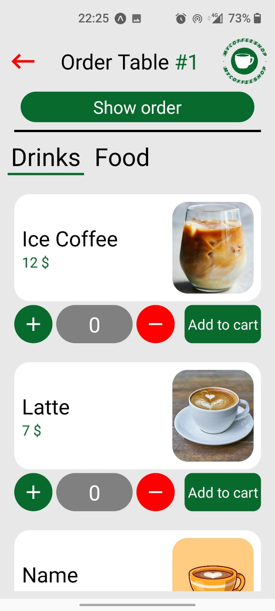

# MyCoffeeShop

## About the application

The motivation for this application came when I saw a newly opened cafe that had problems with stock management, because they were doing it in a notebook. I thought: "If I had a cafe, how would I take care of it and the stock in it?". And then the idea of ​​the application came to me and I decided to create it, being a good way to learn new things. Plus I had an operation on my hand, so I had plany of time :)

The application helps people who want to manage their stock and restaurant products, and make the waiters' job easier and more fun.
  
On the home screen we have 2 buttons, one that leads to the admin page (which can only be accessed by those who know the password) and the employee page which can be accessed by everyone.

  
  
  

In the admin application, he can create new stocks, edit the old ones, delete existing stocks and refill the stock. He can also create his own personalized menu with products, and each product contains existing stock from the restaurant. On the profile page, he can see his profits and losses, because every time he adds products to stock, he loses money, and every time someone buys a product, he makes money.

  
  
  

These are the edit and add pages, simple but do the job

  
  

On the employee's application, you can see 3 types of tables in the store. The black ones represent the tables that are waiting for customers, the green ones represent the tables that have already been ordered, and the red ones mean that the bill has been paid and the table must be cleaned. If the employee clicks on the black table, the menu will open, where he will add everything the customer orders to the basket. After adding everything, he will read the order, and if everything is ok, he will send the order, which will make the table green. If you click on a green table, the bill will appear, and after paying it, the table will turn red. After the table has been cleaned, press the red table, and it turns black again.

  
  
  
  

## Used technologies
  Frontend: React native 
    
  Backend: Java Spring, MySQL

## How can i run it?
  To play this application you must have installed: Node.js, ...
